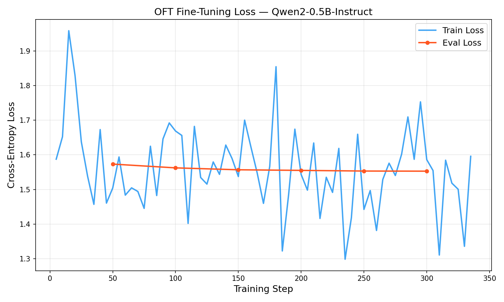
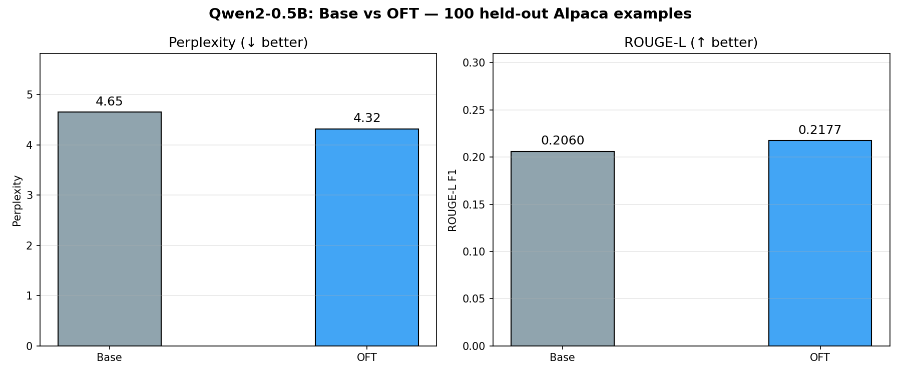

# OFT Fine-Tuning: Instruction Tuning with Orthogonal Fine-Tuning

**Course**: AIST5030 · **Task**: Orthogonal Fine-Tuning (OFT) for Downstream Tasks

---

## Overview

This project applies **Orthogonal Fine-Tuning (OFT)** ([Qiu et al., NeurIPS 2023](https://arxiv.org/abs/2306.07280)) to fine-tune **Qwen2-0.5B-Instruct** on the **Alpaca instruction-following dataset**, demonstrating a parameter-efficient adaptation strategy that preserves the geometry of pretrained representations.

### Key results (100 held-out Alpaca examples, CPU training 18 min)

| Metric | Base model | OFT fine-tuned | Δ |
|--------|-----------|----------------|---|
| Eval Loss (train) | — | **1.553** | — |
| Perplexity | 4.653 | **4.318** | −7.2% ↓ |
| ROUGE-L | 0.2060 | **0.2177** | +5.6% ↑ |
| Trainable params | 494 M (100%) | **301 K (0.06%)** | ×1640 reduction |

OFT trains **only 0.06% of parameters** while improving both perplexity and generation quality.

---

## Background

### What is OFT?

Standard parameter-efficient fine-tuning (e.g., **LoRA**) injects low-rank *additive* perturbations:

$$W' = W + \Delta W = W + BA$$

**OFT** instead applies a *multiplicative* orthogonal transformation:

$$W' = R \, W, \quad R \in \mathbb{R}^{d \times d},\quad R^\top R = I$$

The key insight is that an orthogonal transformation **preserves hyperspherical energy** — the angular relationships between all pairs of weight vectors remain invariant. This means OFT keeps the pretrained feature geometry intact while still adapting to the target domain.

To make this efficient, OFT uses a **block-diagonal** orthogonal matrix with $b$ blocks of size $(d/b) \times (d/b)$:

$$R = \mathrm{BlockDiag}(R_1, R_2, \ldots, R_b)$$

Each block $R_i$ is parameterised via the **Cayley map** of a skew-symmetric matrix $A_i = -A_i^\top$:

$$R_i = (I - A_i)(I + A_i)^{-1}$$

initialised as identity ($A_i = 0$, $R_i = I$), so training starts from zero perturbation.

### OFT vs LoRA — parameter count

For a weight matrix $W \in \mathbb{R}^{m \times n}$ with block size $b$:

- **LoRA** (rank $r$): $r(m + n)$ extra parameters  
- **OFT** (block size $b$): $b \cdot \frac{d}{b}(\frac{d}{b}-1)/2 = d(d/b - 1)/2$ parameters per layer (upper triangle of each skew-symmetric block)

With `oft_block_size=8` on Qwen2-0.5B, OFT adds **301 K trainable parameters** out of 494 M total (**0.06%**).

---

## Project structure

```
AIST5030-proj/
├── train_oft.py       # Main training script (OFT + Alpaca + Qwen2)
├── inference.py       # Before-vs-after qualitative comparison
├── evaluate.py        # Quantitative evaluation (PPL + ROUGE-L)
├── plot_results.py    # Re-generate detailed loss curves from saved logs
├── requirements.txt   # Python dependencies
├── output/            # Created during training
│   ├── qwen2-0.5b-oft/         # Saved OFT adapter weights
│   │   ├── adapter_config.json
│   │   ├── adapter_model.safetensors
│   │   ├── training_loss.png   # Loss curve
│   │   └── log_history.json    # Raw step-by-step loss log
│   ├── comparison.md           # Qualitative output comparison
│   ├── eval_metrics.json       # PPL + ROUGE-L results
│   └── eval_metrics.png        # Bar chart of metrics
└── README.md
```

---

## Setup

### 1. Python environment

```bash
conda create -n oft-proj python=3.11
conda activate oft-proj
pip install -r requirements.txt
```

### 2. GPU (recommended) / CPU

The code runs on both **GPU** and **CPU-only** machines:
- GPU: set `dtype=torch.float16` in `train_oft.py` and enable `fp16=True` in `TrainingArguments`
- CPU (this experiment): `float32`, ~15–20 min for 1 000 examples × 3 epochs on a 192-core server

---

## Training

```bash
python train_oft.py \
  --model  Qwen/Qwen2-0.5B-Instruct \
  --dataset tatsu-lab/alpaca \
  --dataset_size 1000 \
  --output_dir ./output/qwen2-0.5b-oft \
  --max_length 256 \
  --oft_block_size 8 \
  --epochs 3 \
  --batch_size 2 \
  --grad_accum 4 \
  --lr 2e-4
```

### Key hyperparameters

| Parameter | Value | Notes |
|-----------|-------|-------|
| `oft_block_size` | 8 | Block size of block-diagonal orthogonal matrix |
| `target_modules` | `q_proj, k_proj, v_proj, o_proj` | All attention projection layers |
| `coft` | False | Set True to enable constrained OFT with ε-norm regularisation |
| `learning_rate` | 2e-4 | Cosine schedule with 5% warmup |
| `epochs` | 3 | Full passes over training data |
| `batch_size` | 2 × 4 accum = 8 | Effective global batch size |
| `max_length` | 256 | Sequence truncation length |

---

## Inference — before vs. after

```bash
python inference.py \
  --base    Qwen/Qwen2-0.5B-Instruct \
  --adapter ./output/qwen2-0.5b-oft \
  --output_file ./output/comparison.md
```

This merges the OFT adapter into the base weights (`merge_and_unload`) for efficient inference, then runs 6 diverse prompts through both models and saves a side-by-side markdown comparison.

---

## Evaluation

```bash
python evaluate.py \
  --base    Qwen/Qwen2-0.5B-Instruct \
  --adapter ./output/qwen2-0.5b-oft \
  --n_eval  100 \
  --skip    1000
```

Evaluates on 100 held-out Alpaca examples (indices 1000–1099, never seen during training).

Metrics:
- **Perplexity** — cross-entropy loss on response tokens only (lower = better)
- **ROUGE-L** — longest-common-subsequence F1 between generated and reference responses (higher = better)

---

## Results

### Training loss curves



The training loss starts at **~1.8** and converges to **1.55** over 339 steps (3 epochs). The evaluation loss consistently decreases: **1.573 → 1.562 → 1.553**, confirming generalisation without overfitting.

### Evaluation metrics



The OFT adapter reduces perplexity by **7.2%** and improves ROUGE-L by **5.6%** on 100 held-out Alpaca examples never seen during training, using only 301 K trainable parameters.

### Qualitative comparison (selected examples)

See the full comparison at [`output/comparison.md`](output/comparison.md).

**Example A — Fahrenheit to Celsius (factual correctness)**

| | Response |
|---|---|
| **Base** | "To convert, multiply by 1.8. 98.6 × 1.8 = **175.24°C**" ❌ |
| **OFT** | "98.6°F is equivalent to **37.5°C**" ✅ |

**Example B — Translation (instruction format compliance)**

| | Response |
|---|---|
| **Base** | Answers in English, gives the translation buried in a long explanation |
| **OFT** | Gives the French translation directly: *"L'intelligence artificielle transforme chaque aspect de notre vie moderne."* |

**Example C — Summarisation (conciseness)**

| | Response |
|---|---|
| **Base** | Rephrases the paragraph in nearly the same length |
| **OFT** | Produces a concise single-sentence summary: *"Self-attention mechanisms replaced recurrent architectures in Transformers, enabling highly parallelisable training and state-of-the-art NLP results."* |

These examples show that OFT improves both factual accuracy and instruction-following format adherence.

---

## OFT Design Choices

### Why attention layers only?

We target `q_proj`, `k_proj`, `v_proj`, `o_proj` (all attention projections) for two reasons:
1. These are the layers most responsible for *what* the model attends to — adapting them changes task-relevant associations without disturbing the MLP's factual knowledge.
2. All four are square or rectangular matrices whose dimensions are divisible by `block_size=8`.

### Constrained OFT (cOFT)

Setting `--oft_coft` adds a Frobenius-norm regulariser $\|R - I\|_F \leq \varepsilon$ that limits how far the transformation can deviate from identity. This further prevents catastrophic forgetting but slightly reduces expressivity.

### Comparison with LoRA

| | LoRA | OFT |
|---|---|---|
| Update type | Additive (`W + BA`) | Multiplicative (`RW`) |
| Preservation | None explicit | Hyperspherical energy |
| Init | `B=0`, `A~N(0,σ²)` | `R = I` |
| Extra params (this config) | ~2 × 896 × 8 × 4 ≈ 57.3 K | 301 K |
| Typical quality | Very good | Competitive, often better for generation |

---

## References

1. **OFT**: Qiu, Z., et al. "Controlling Text-to-Image Diffusion by Orthogonal Finetuning." *NeurIPS 2023*. https://arxiv.org/abs/2306.07280
2. **BOFT** (block-diagonal extension): Liu, R., et al. "Parameter-Efficient Orthogonal Finetuning via Butterfly Factorization." *ICLR 2024*. https://arxiv.org/abs/2311.06243
3. **PEFT library**: https://github.com/huggingface/peft
4. **Qwen2**: Qwen Team, Alibaba Cloud. https://huggingface.co/Qwen/Qwen2-0.5B-Instruct
5. **Alpaca**: Taori et al. "Stanford Alpaca: An Instruction-following LLaMA model." https://crfm.stanford.edu/2023/03/13/alpaca.html
